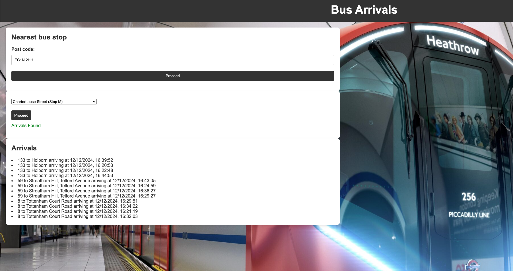

# Bus Arrivals

This project aims to provide real-time bus arrival information.

## Progress



## Features

- Real-time bus arrival times
- Search by bus stop
- User-friendly interface :smiley:

## Requirements

- Python 3.8+
- Flask
- Requests

## Installation

1. Clone the repository:
   ```bash
   git clone https://github.com/yourusername/bus-arrivals.git
   ```
2. Navigate to the project directory:
   ```bash
   cd bus-arrivals
   ```
3. Install the dependencies:
   ```bash
   pip install -r requirements.txt
   ```

## Usage

1. Run the application:
   ```bash
   python app.py
   ```
2. Open your web browser and go to `http://localhost:5000`.
